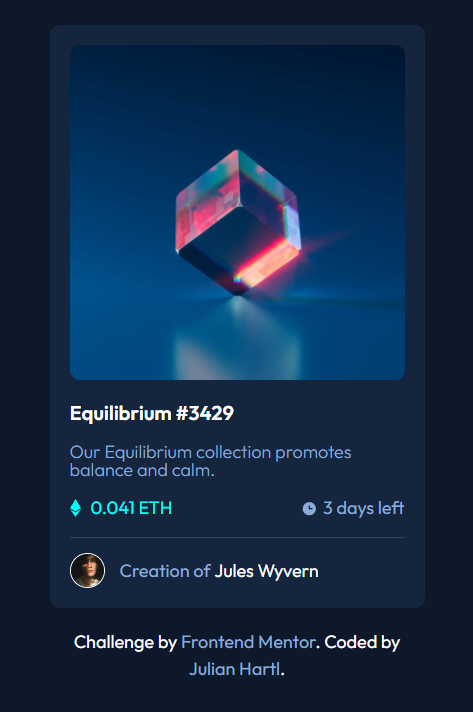

# Frontend Mentor - NFT preview card component solution

This is a solution to the [NFT preview card component challenge on Frontend Mentor](https://www.frontendmentor.io/challenges/nft-preview-card-component-SbdUL_w0U). Frontend Mentor challenges help you improve your coding skills by building realistic projects. 

## Table of contents

- [Overview](#overview)
  - [The challenge](#the-challenge)
  - [Screenshot](#screenshot)
  - [Links](#links)
- [My process](#my-process)
  - [Built with](#built-with)
  - [What I learned](#what-i-learned)

## Overview

### The challenge

Users should be able to:

- View the optimal layout depending on their device's screen size
- See hover states for interactive elements

### Screenshot



### Links

- Solution URL: [See solution](https://github.com/JuHar-dev/nft-preview-card)
- Live Site URL: [See live site](https://nft-preview-card-ecru.vercel.app/)

## My process

As this is a pretty layout to build, it only took me about an hour to get it done, but it was fun and I learned some new stuff.

### Built with

- Semantic HTML5 markup
- CSS custom properties
- Flexbox
- Mobile-first workflow

### What I learned

- How to make an image overlay

```html
<div class="nft-image-container">
            
            <div class="nft-image-overlay">
              
            </div>
          </div>
```
```css

.nft-image {
    width: 100%;
    border-radius: 10px;
}

.nft-image-container {
    max-width: 100%;
    position: relative;
}

.nft-image-overlay {
    position: absolute;
    top: 0;
    left: 0;
    width: 100%;
    height: 100%;
    display: none;
}

.nft-image-container:hover .nft-image-overlay {
    display: flex;
    border-radius: 10px;
    background-color: hsla(178, 100%, 50%, 60%);
    align-items: center;
    justify-content: center;

}

```


